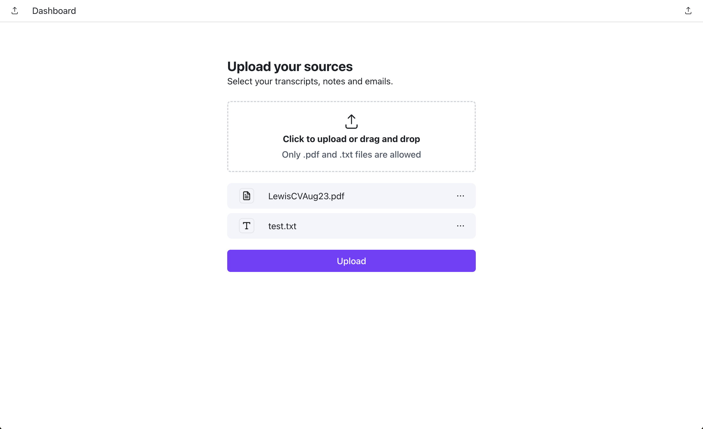

## Getting Started

Start the backend

`npm run dev`

Start the frontend

`npm run dev`

## Assumptions
1. Files are added separately and then all uploaded when the button is pressed
2. Upload one file at a time
3. Each file has a 6sec timeout (set on axios)
4. We don't care if it is exact copy of the figma (i.e. fonts, colors, padding don't nee to be exact)
5. Speed over quality - a lot of features for 2hrs - so no tests or refactoring for good structure (and some features missing)
6. The spec doesn't say how to show errors to users - so I've used a 3rd party toaster
7. Not sure what to persist in the db - so I've just added filename, userid and s3 location

## Limitations
All these limitations are caused by the time constraint...

1. I've not researched better ways to upload/store files - just used the obvious way (which may not be good for large files etc..)
2. Lots of nasty hard coding (including in css)
3. No error checking server side - and little client side - so lots of edge cases are not covered
4. I've used rubbish icons in many places - ideally I would use an icon library and logos instead (i.e Radix Icons don't include PDF or TXT images, or a Spinner of the correct style, etc..)
5. No automated tests - I've just run some manual ones
6. Not built for multi-lingual etc..

